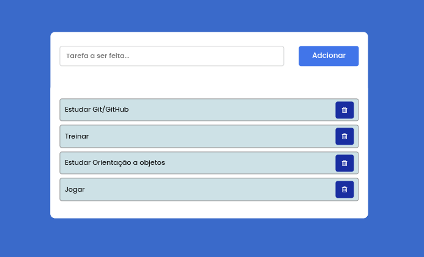

# To-do List 

Este Projeto foi criado para colocar em prática meus conhecimentos adquiridos sobre HTML5 e CSS3 e JavaScript.

O objetivo desse projeto foi aplicar meus aprendizados em HTML5, CSS3 e JavaScript para tornar a pagina dinâmica e por em prática meus conhecimentos sobre manipuilação da DOM

## Tecnologias utilizadas

* HTML5
* CSS
* JavaScript
* Font Awesome

## Layout do projeto

### Autor

LinkedIn: https://www.linkedin.com/in/alan-fernandes-03096317b/

Instagram: https://www.instagram.com/_alanfernds/

E-mail: alanfernandes.mm@gmail.com

